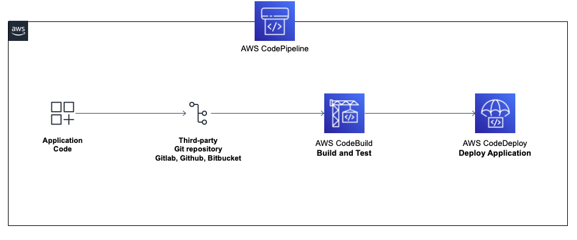

# Application Pipeline (WIP)

### High level proposed architecture for the application pipeline

### Description

High-level description on how to deploy the current application pipeline using Gitlab/Github/others, AWS CodeBuild, AWS CodeDeploy, managed by AWS CodePipeline.

1. Gitlab: The code will be stored in a Gitlab/Github repository. When we push changees to the repository, Gitlab will trigger a webhook to notify AWS CodePipeline to start the pipeline. 
2. AWS CodePipeline: The service helps automate the pipelines, it manage the build, test, and deployment processes. The CodePipeline will have three stages: Source, Build, and Deploy. 
3. Source stage: This stage will use Gitlab as the source provider. AWS CodePipeline will pool gitlab for changes, and when changes are detected, it will pull the latest code and send it to the next stage.
4. Build stage: In this stage, we will define a buildspec.yml file that defines the steps for build and test the application. As the application is a Python code, we won't do any compiling, just run unit tests.  
5. Test stage: In this stage, We may use SonarQube to run code quality checks. If the application code meets the criteria, the pipeline will continue; otherwise, the pipeline will fail and stop. (CodeBuild)
6. Cleanup stage: Optional stage, we can add a manual approval action. This stage can be used to clean up resources or confirm that everything has been deployed sucessfully. 

**In summary:**

1. Changes pushed to Gilab repository trigger the AWS CodePipeline
2. CodePileline's Source stage fetches the latest code from Gitlab
3. CodePipeline's Build stage compiles and packages the code, runs the unit tests.
4. SonarQube checks the code quality.
5. If the code meets the quality criteria, the pipeline moves forward.
6. AWS CodeDeploy deploys the application to the specified environment.
7. Optional Cleanup stage with manual approval action to clean up resources or confirm everything has been deployed.

